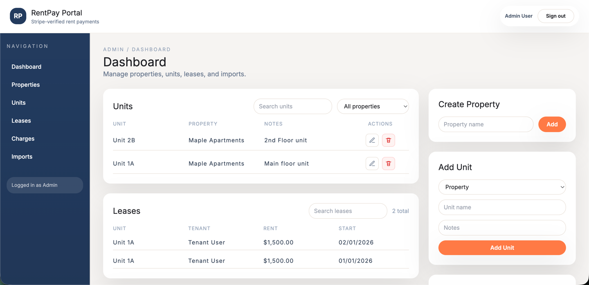

# RentPay Portal

Full-stack rent payment MVP demo built with **Laravel + React (Vite) + Stripe (test mode)**. Designed as a portfolio-ready admin/tenant workflow with modern UI/UX and clean API boundaries.



## Features
- Admin: manage properties, units, leases, and charges
- Tenant: view balance, pay rent, view payment history
- Stripe Checkout (test mode) + webhooks
- CSV imports (units, leases, charges)
- Role-based access control (Admin vs Tenant)

## Project Structure
```
payment-portal/
  rentpay-api/   # Laravel API
  rentpay-web/   # React + Vite frontend
  docs/          # Screenshots and supporting docs
```

## Tech Stack
- **Backend:** Laravel 12, Sanctum, MySQL, Stripe PHP
- **Frontend:** React + TypeScript, Vite, React Query, Axios, Zod, Tailwind CSS

## Architecture Notes
- Role-based access (admin vs tenant) enforced with policies + Sanctum
- Stripe payments finalized via webhooks only
- CSV imports validated with ownership checks and row limits
- Payments are created as pending; status is updated only via Stripe webhook

## Demo Accounts
Seeded credentials (via `php artisan db:seed`):

- **Admin**: `admin@rentpay.test` / `password`
- **Tenant**: `tenant@rentpay.test` / `password`

## Local Setup

### 1) Backend (Laravel)
```bash
cd rentpay-api
cp .env.example .env
composer install
php artisan key:generate
```

Update `.env` for MySQL:
```
DB_CONNECTION=mysql
DB_HOST=127.0.0.1
DB_PORT=3306
DB_DATABASE=rentpay
DB_USERNAME=rentpay
DB_PASSWORD=your_password
```

Run migrations + seed:
```bash
php artisan migrate:fresh --seed
php artisan serve
```

### 2) Frontend (React)
```bash
cd rentpay-web
npm install
npm run dev
```

Vite runs at: http://localhost:5173
Laravel runs at: http://localhost:8000

## Stripe (Test Mode)

1) Add keys in `rentpay-api/.env`:
```
STRIPE_SECRET=sk_test_...
STRIPE_WEBHOOK_SECRET=whsec_...
STRIPE_CHECKOUT_SUCCESS_URL=http://localhost:5173/tenant
STRIPE_CHECKOUT_CANCEL_URL=http://localhost:5173/tenant
```

2) Listen for webhooks:
```bash
stripe listen --forward-to http://localhost:8000/api/webhooks/stripe
```

3) Use a test card in Checkout:
```
4242 4242 4242 4242
Any future date / Any CVC / Any ZIP
```

## CSV Import Templates
Use the Download Template buttons in the Admin UI, or create CSVs with these headers:

- **Units:** `property_id,name,notes`
- **Leases:** `unit_id,tenant_user_id,rent_amount,due_day,start_date,end_date`
- **Charges:** `lease_id,amount,due_date,status`

## API Notes
- Admin CRUD: `/api/properties`, `/api/units`, `/api/leases`
- Admin imports: `/api/admin/import/*`
- Tenant endpoints: `/api/tenant/charges`, `/api/tenant/payments`
- Checkout: `/api/payments/checkout`
- Webhooks: `/api/webhooks/stripe`

## Useful Commands
```bash
# Backend tests
cd rentpay-api
php artisan test

# Frontend lint
cd rentpay-web
npm run lint

# Vite dev server
cd rentpay-web
npm run dev
```

## Roadmap Ideas
- Edit leases + charges (full CRUD)
- ACH payments (Stripe Financial Connections)
- Audit log UI and CSV export for payments
- Admin CSV export for payments (pro feature)

## License
MIT
